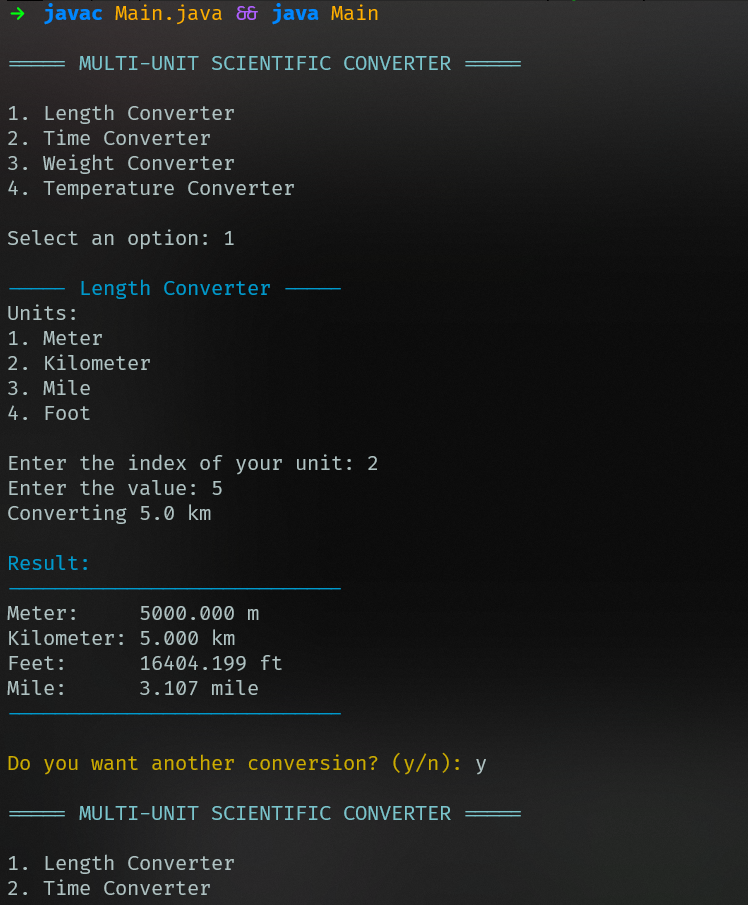
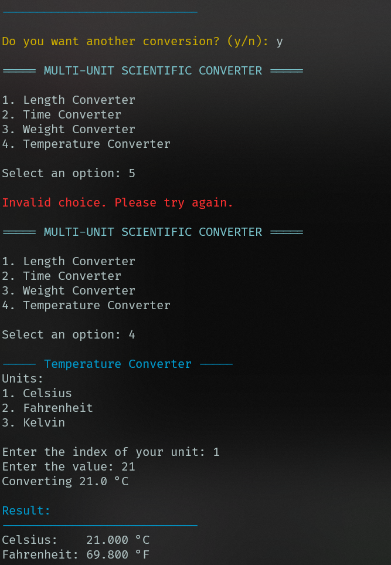
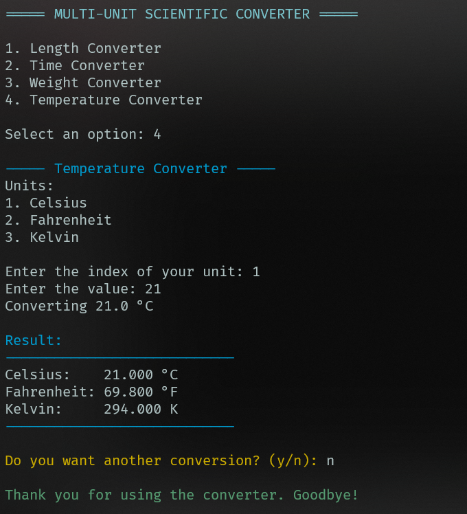

# 🔬 Multi-Unit Scientific Converter

A **Java console application** to convert **Length, Time, Weight, and Temperature** units.  
This project demonstrates **object-oriented programming (OOP)** principles such as **inheritance** and **encapsulation**.

---

## 🚀 Features

✅ Convert between multiple units:

| Converter Type   | Units                               |
|-----------------|------------------------------------|
| **Length**       | Meter, Kilometer, Mile, Foot       |
| **Time**         | Second, Minute, Hour               |
| **Weight**       | Gram, Kilogram, Pound              |
| **Temperature**  | Celsius, Fahrenheit, Kelvin        |

✅ Console-based user interface  
✅ Input validation for units and values  
✅ Repeat conversion without restarting the program  

---

## 🏗️ Project Structure

📦 Multi-Unit Scientific Converter
- `Converter` → Base class containing common attributes (`unit`, `value`) and methods (`conversion()`, `display()`)  
- `LengthConverter` → Converts between meters, kilometers, feet, and miles  
- `TimeConverter` → Converts between seconds, minutes, and hours  
- `WeightConverter` → Converts between grams, kilograms, and pounds  
- `TemperatureConverter` → Converts between Celsius, Fahrenheit, and Kelvin  
- `Main` → Handles user interface and program flow  

---

## 🧩 Technologies

- **Language:** Java  
- **OOP Concepts:** Inheritance, Polymorphism, Encapsulation  
- **Console Output:** ANSI color codes for visual enhancement  

---

## 🖥️ Example Output

---

## 👤 Author

**Salem Nur Abir**  
CSE Student at AIUB

---

## 📌 UML Diagram

---